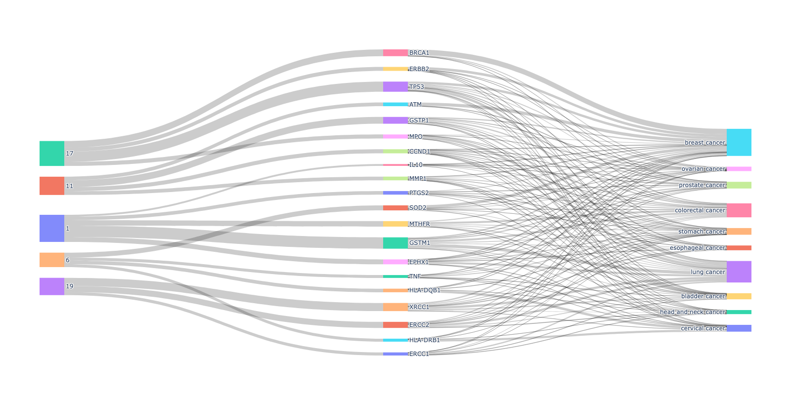

# Cancer Gene–Chromosome Association Analysis  
**Author:** Teddy Pomianek  
**Course:** CS3200 – Introduction to Databases, Northeastern University with Prof. Carter Ithier

---

## Project Overview
This project analyzes the relationship between human chromosomes and cancer-associated genes using data from the Genetic Association Database (GAD).  

The goal was to identify the chromosomes that are most frequently associated with cancer-linked genes in biological literature contained in GAD. Using SQL for data management and Python for visualization.

---

## Data Source
- Genetic Association Database (GAD), NCBI  
- Becker KG et al., *Nucleic Acids Research* (2004)  
- https://geneticassociationdb.nih.gov/

---

## Tools and Technologies
- MySQL for data storage, cleaning, and aggregation  
- Python (pandas, matplotlib, plotly) for analysis and visualization  
- Git and GitHub for version control  

---

## SQL Process
1. Created and populated the `gad` database using data from `gad.csv`.  
2. Removed null or blank chromosome values.  
3. Aggregated all cancer-related genes by chromosome using the following query:

   ```sql
   SELECT gene AS gene_symbol, chromosome, gene_name, COUNT(*) AS gene_count
   FROM gad
   WHERE disease_class = 'CANCER'
     AND chromosome IS NOT NULL
     AND chromosome <> ''
   GROUP BY chromosome, gene, gene_name
   ORDER BY chromosome, gene_count DESC;
  sql```

4. After running this SELECT query, the results were exported as "cancer_genes.csv" inside MySQLWorkbench.

---

### Sample Data from "cancer_genes.csv"
First 5 rows of "cancer_genes.csv":
```
gene_symbol,chromosome,gene_name,gene_count
GSTM1, 1, "Glutathione S-transferase M1", 164
MTHFR, 1, "Chromosome 1 open reading frame 167", 82
EPHX1, 1, "Epoxide hydrolase 1, microsomal (xenobiotic)", 57
IL10, 1, "Interleukin 10", 42
PTGS2, 1, "Prostaglandin-endoperoxide synthase 2 (prostaglandin G/H synthase andcyclooxygenase)", 38
```

---

## Visualizations and Results

### Cancer-Linked Gene Count by Chromosome Histogram


Chromosomes 1, 6, 11, and 17 were identified as the chromosomes most frequently related to cancer-linked genes. 

### Top 5 Chromosomes Mapped to Their Most Studied Genes, Those to Cancer Phenotypes Associated with Those Genes


The Sankey diagram depicted above has 3 levels. The left side of the diagram shows the 5 chromosomes with the highest number of cancer-linked gene associations appearing in GAD studies. The middle shows the 20 most frequently studied cancer-linked genes found associated with those chromosomes. The right side shows the 10 most common cancer phenotypes those genes are associated with. 

Using the diagram, it is possible to see which cancer types are connected to specific genes. Breast cancer (with incoming flow count 20), stomach cancer (18), and colorectal cancer (16) are the top 3 cancer types associated with the largest number of distinct genes in the diagram. These conclusions point to how certain types of cancer are caused by mutations from a larger range of genetic mechanisms across the body. 

Another conclusion supported by the diagram is how different genes, chromosomes, and cancer types have different thicknesses which describe how they appear in less studies (where they are associated with these specific genes not overall) in the GAD database. More common types of cancer including breast cancer, lung cancer, and colorectal cancer are included in more studies associated with top cancer-linked genes. 

For genes such as GSTM1 commonly studied alongside common cancer types, it might be useful to commit more research in connection to less common cancer types. GSTM1 is connected to 10 different cancer types some more common than others. Studying its interactions with rarer types of cancer may give way to conclusions about how it interacts with more common types of cancer.

Overall, this Sankey diagram can be a good indicator of areas of cancer research that need more attention. In the future there could be many useful alterations made for this diagram. For example, instead of listing most common cancer phenotypes related to these genes, the diagram could also compare the rarest types of cancer with fewer overall publications in GAD.
