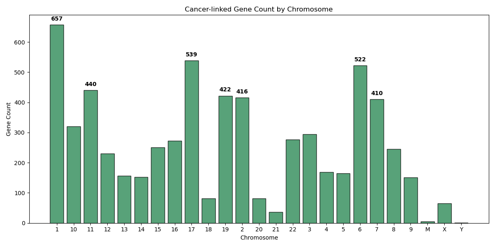

# Cancer Gene–Chromosome Association Analysis

**Author:** Teddy Pomianek  
**Course:** CS3200: Introduction to Databases
**Institution:** Northeastern University  

This project explores the connection between human chromosomes and genes linked to cancer using data from the Genetic Association Database (GAD).  
The purpose of this poject is to identify which chromosomes have the highest concentration of cancer-associated genes.

## Files for This Project
- **cancer_chromosome_analysis.sql** – Creates the `gad` database, loads the dataset, and queries cancer-linked genes by chromosome.
- **gene_plot.py** – Visualizes total gene associations per chromosome using Matplotlib.
- **gene_count.png** – Output bar chart showing gene counts by chromosome.
- **gad.csv** – Source dataset from the Genetic Association Database.
- **cancer_genes.csv** – Filtered dataset of cancer-linked genes.

## Output

## Tools Used
- MySQL Workbench  
- Python (pandas, matplotlib)  
- CSV data manipulation  

## Description
Using SQL and Python, I:
1. Created a GAD database in MySQL and loaded the dataset.
2. Queried gene–chromosome relationships for cancer-linked genes.
3. Visualized the frequency of these genes across chromosomes to identify potential genomic “hotspots” for cancer research.

## Citation
Genetic Association Database (GAD): Becker KG et al., *Nucleic Acids Research*, 2004.  
[NCBI GAD Portal](https://geneticassociationdb.nih.gov/)
